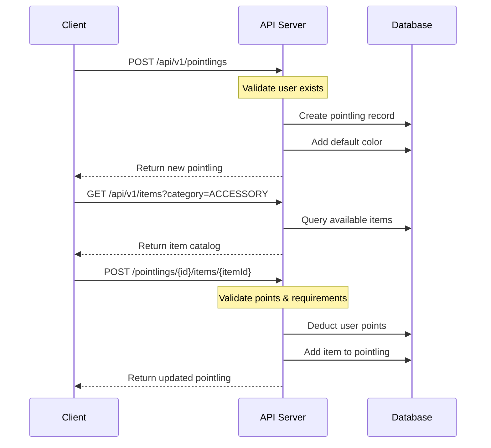
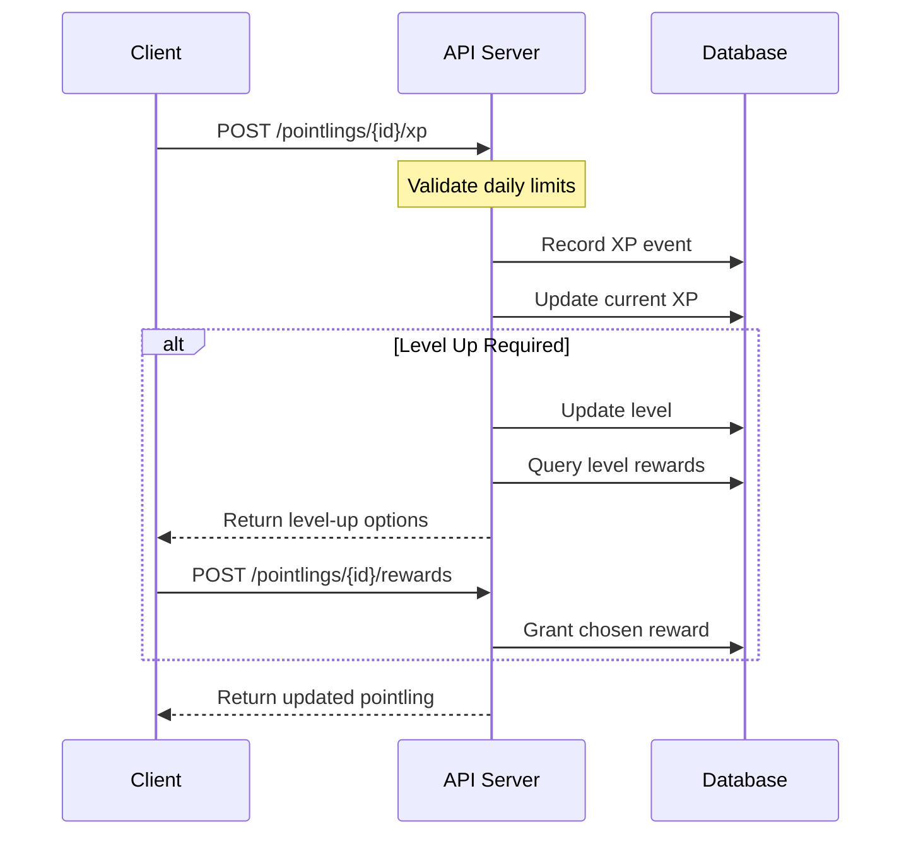
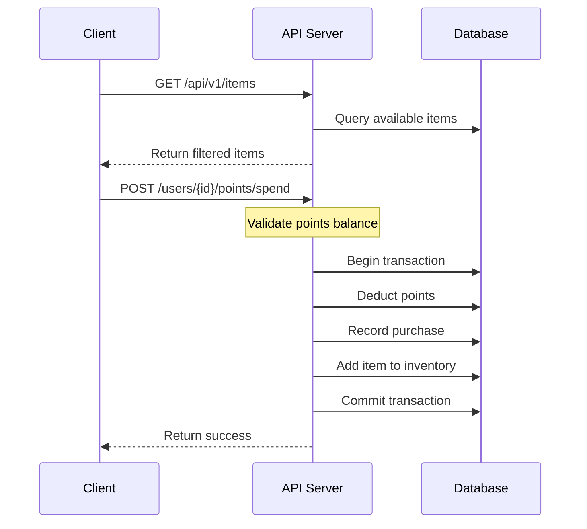
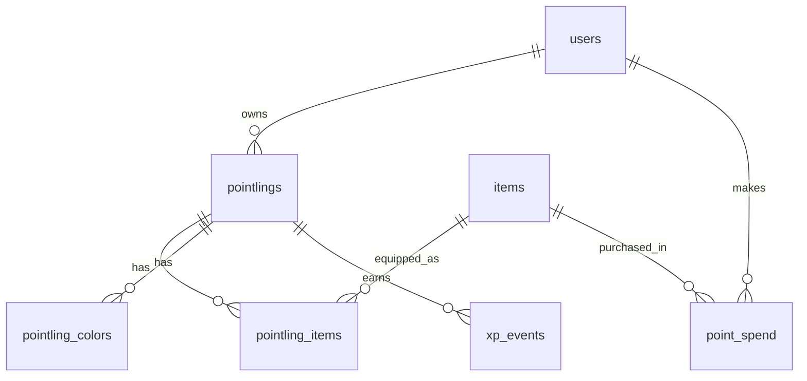

# System Flow Diagrams

## Pointling Creation and Customization Flow

## XP and Leveling Flow

## Item Purchase Flow

## Data Model Relationships

## Key Business Rules

1. XP and Leveling

   - Daily XP caps per source type
   - Linear XP growth (3 to 120)
   - Level rewards (3 options, pick 1)
   - Color unlocks every 5 levels

2. Points and Items

   - Points can only be spent on available items
   - Items may require specific levels
   - Each slot can have one equipped item
   - Colors don't count as equipped items

3. Customization

   - Features are permanent once unlocked
   - Accessories can be toggled
   - Base customization is always available
   - Some items may be limited time only

4. Transaction Safety
   - Point spends must be atomic
   - XP calculations must be race-condition safe
   - Item equipped status must be consistent
   - Level-up rewards must be exactly one choice
